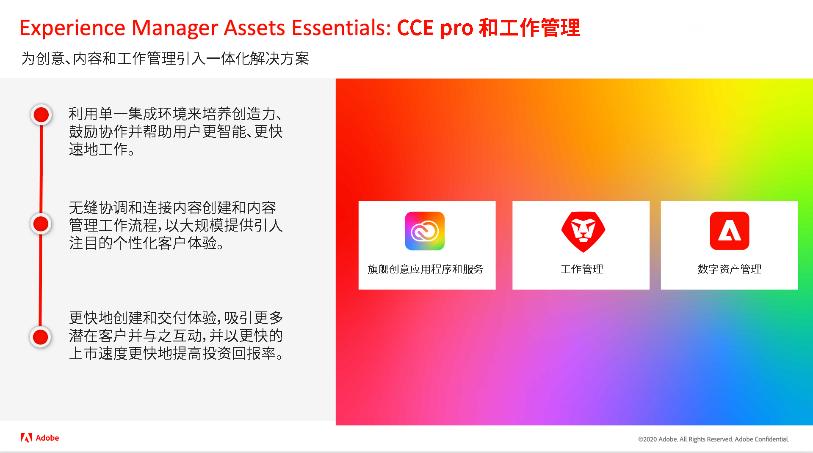
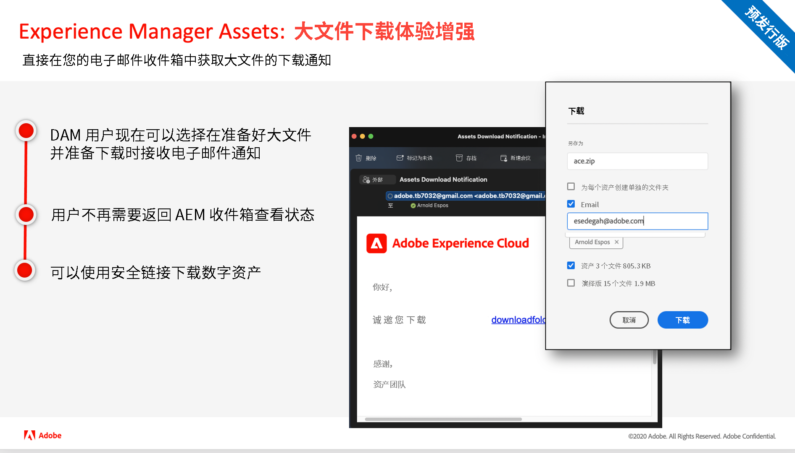
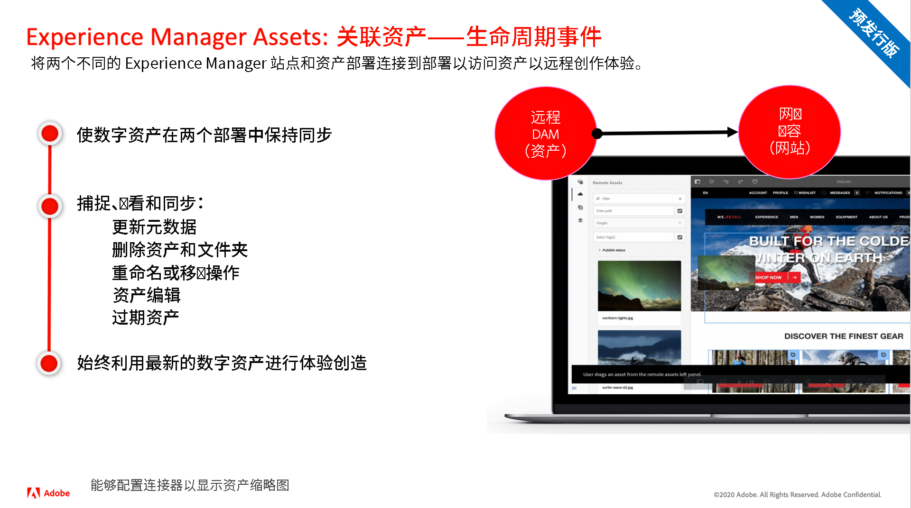

# Adobe Experience Manager as a Cloud Service版本更新

快速概述Adobe Experience Manager as a Cloud Service的最新功能。 这些是由AEM产品团队交付的简短视频，大约为10分钟，其中介绍了最新版本的亮点。

## 最新更新

<table style="max-width: 50%;">
<tr>
  <td>
    
    

      <a href="./2022/2022-3-0.md">
        <strong>版本 | 2022.3.0</strong>
         
      </a>
        <em>发布于2022年3月31日 </em>
    

    

      <a href="https://experienceleague.adobe.com/docs/experience-manager-cloud-service/content/release-notes/release-notes/release-notes-current.html">发行说明</a>
    

  </td>
</tr>  
</table>

## 过去的更新

<table style="max-width: 50%;">
<tr>
  <td>
    
    

      <a href="./2022/2022-1-0.md">
        <strong>版本 | 2022.1.0</strong>
         
      </a>
        <em>发布于2022年2月3日 </em>
    

    

      <a href="https://experienceleague.adobe.com/docs/experience-manager-cloud-service/content/release-notes/release-notes/2022/release-notes-2022-1-0.html">发行说明</a>
    

  </td>
  <td>
    
    

    <a href="./2021/2021-11-0.md">
        <strong>版本 | 2021.11.0</strong>
         
      </a>
    <em>发布于2021年12月16日</em>
    

    

      <a href="https://experienceleague.adobe.com/docs/experience-manager-cloud-service/content/release-notes/release-notes/2021/release-notes-2021-11-0.html">发行说明</a>
    

  </td>
</tr>
</table>
